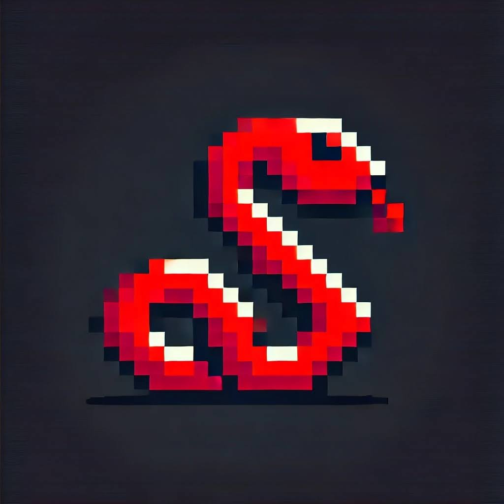

# Prem Saraf - Portfolio & Frontier AI Showcase

Welcome to the personal portfolio repository of **Prem Saraf** ([@DeveloperX-debug](https://github.com/DeveloperX-debug)).

This modern portfolio highlights expertise in **Frontier LLM Architectures**, **Agentic Workflows**, **RAG Indexing**, and **Full-Stack Web Development**.

---

## ⚡ Key Highlights & LLM Ecosystem

- **Frontier LLM Integrations**: Google Gemini 1.5 Pro & Flash (2M Token Context), Anthropic Claude 3.5 Sonnet (SWE-bench SOTA), OpenAI GPT-4o & o1, Meta Llama 3.1 (405B / 70B), DeepSeek V3 / R1, Qwen 2.5.
- **Interactive Live Prompt Sandbox**: Real-time simulated token streaming terminal with latency and token telemetry.
- **Model Comparison Matrix**: Benchmark progress tracking across MMLU-Pro, HumanEval, and Math reasoning.
- **Full-Stack Web Projects**: Django e-commerce & hotel management backends, JavaScript games (Snake PWA, Unfinished Clock, Tic-Tac-Toe, Calculator), and modern responsive web apps.

---

## 🛠 Tech Stack

- **AI & LLM Tooling**: Cursor IDE, LangChain, LlamaIndex, Qdrant Vector DB, Instructor, Ollama, vLLM.
- **Frontend & UI**: HTML5 Canvas, CSS3 Glassmorphism & Custom Keyframe Animations, Vanilla ES6+ JS.
- **Backend & Systems**: Python, Django, FastAPI, RESTful APIs, Git / GitHub CI.

---

## 🌐 Live Website

- **Portfolio URL**: [https://developerx-debug.github.io/Portfolio/](https://developerx-debug.github.io/Portfolio/)
- **GitHub Username**: [DeveloperX-debug](https://github.com/DeveloperX-debug)